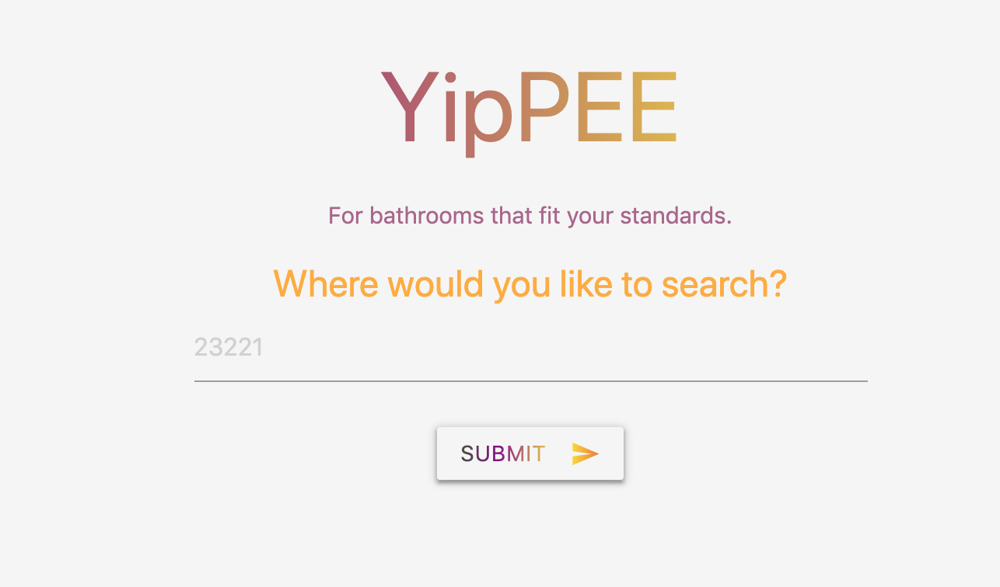
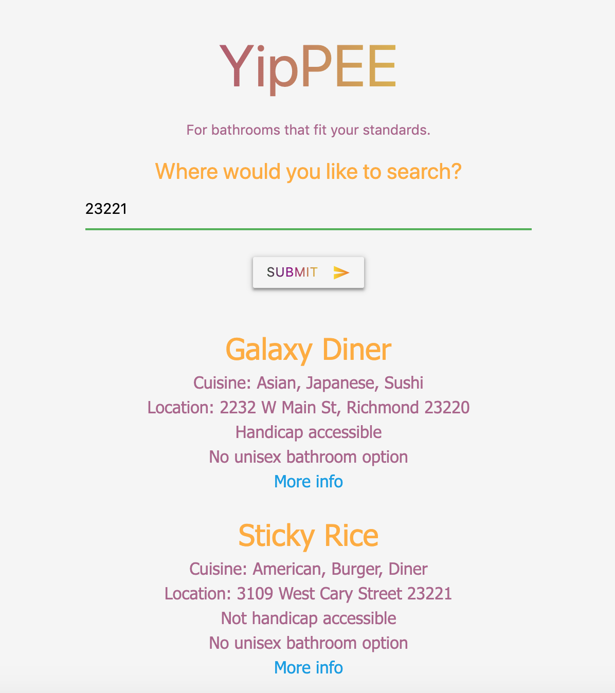

# YipPEE Application Overview

This group project is an attempt to create an interactive site that will allow the user to find a restaurant that they are interested in visiting and finding out the rating of their restroom facilities as it relates to ADA and gender-neutral standards of accessibility, as well as clenliness.

Why is it important to know about a restaurants restroom facilities? "Restaurants of any size are regulated by a variety of local, state and federal laws dealing with health and safety for customers and employees. A critical component of restaurant design is providing restrooms for customers and employees, and for both men and women in each category. This includes the physical facilities and signage, as well as provision for handicapped or wheelchair access." (https://smallbusiness.chron.com/restroom-requirements-restaurants-41132.html) Although establishments may follow these minimum guidelines, some facilities are better than others, and when it comes to feeling comfortable going out for a worry-free night, it's best to have one less thing on your mind.

In this group project, we (Mandy Lloyd, Sarah Kerr, and Kenya Allen) built a web application conceived and executed to solve the real world problem that many face every time they visit a new establishment; Will the restrooms fit their needs and standards? The YiPEE application receives data from multiple server-side APIs (Zomato and Refugee Restrooms) to provide information on both the restaurant from a dining standpoint and from a bathroom accessibility standpoint. Because we worked collaboratively, we learned agile development methodologies and implemented features and bug fixes using the git branch workflow and pull requests.

In this application users will locate a restaurant based on their food preferences for the evening and then search that restaurant's restroom ratings.  

By using this application, you are one quick search away from finding knowing if the restaurant that you will be socializing in meets all of your YiPEE needs.

# APIs 

Zomato API: https://developers.zomato.com/api

Refugee Restrooms API: https://www.refugerestrooms.org/api/docs/

Google Geolocation API: https://developers.google.com/maps/documentation/geolocation/intro 

# Application Photos 

Website home screen, with no searches: 

Zip code search results: 

Sign key: 

